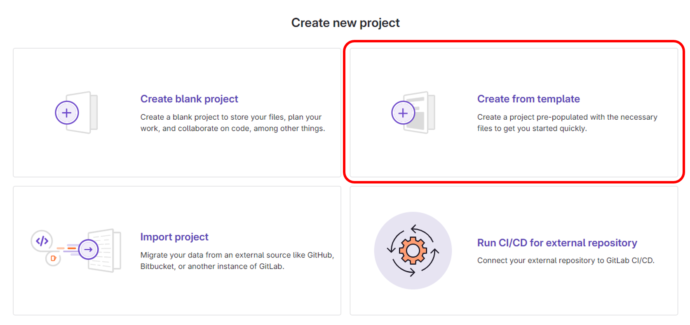
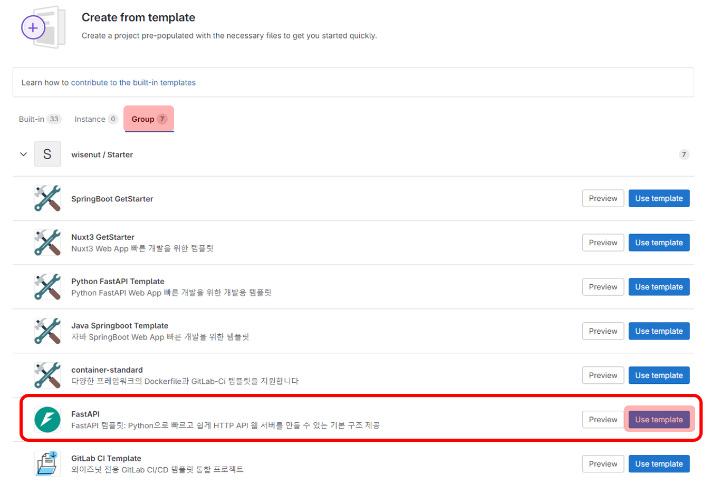

# Quick start


## 0. Create Project from template

> 빠른 프로젝트 생성을 위한 GitLab Template 사용법

1. GitLab `Create new project` 을 통해 새로운 프로젝트 생성
2. `Create from template` 선택    
    
3. `Group` 선택
4. **FastAPI**에서 `Use template` 선택 
   
5. _Project name, Project description (optional)_ 등을 작성하고 `Create project` 선택

## 1. Install Requirements

```bash
$ apt-get install -y python39 && python3 --version && pip3 --version
$ pip3 install -U poetry
```

## 2. Install Dependencies

```bash
$ poetry install --no-root
```

## 3. Run app

### [방법 1] 가상환경 자동 진입

```bash
$ poetry run uvicorn app.main:app --host 0.0.0.0 --port <port number>
```

### [방법 2] 가상환경 직접 진입

```bash
# 가상환경 활성화 후 FastAPI uvicorn 실행
$ poetry shell
(python-fastapi-template-py3.9) $ uvicorn app.main:app --host 0.0.0.0 --port <port number>
```

## 4. API call

> Python FastAPI Template은 기본적으로 API 호출시 `x-token=wisenut`으로 사용 권한 헤더 토큰이 설정되어있습니다. (참고: `app/utils/authentication.py`)    
> 사용 권한 토큰값을 변경하고 싶은 경우에는 `.env`, `app/config.py` 파일에 해당하는 값을 수정하면 됩니다.

```bash
curl -X 'GET' \
'https://localhost:8000/items' \
-H 'x-token: wisenut'
```

`x-token`을 토큰을 설정하지 않을 경우, 아래와 같은 응답이 나옵니다.

```json
{
    "code": 100403,
    "message": "Not authenticated",
    "result": {
        "headers": null
    }
}
```

`x-token` 값이 틀렸을 경우, 아래와 같은 응답이 나옵니다.

```json
{
    "code": 100401,
    "message": "Invalid x-token header",
    "result": {
        "current_x_token": "wisenutsd"
    }
}
```

## Quick start with Docker

```bash
$ docker build -t python-fastapi-template:dev -f dev.Dockerfile .
$ docker run -d --rm --name python-fastapi-template -p 8000:8000 -e X_TOKEN=wisenut python-fastapi-template:dev
```

### 참고
$HOME 경로에서 `python app/version.py`를 실행하여 `version_info.py` 파일을 생성한 후 진행하셔야 정상적으로 빌드 후 실행이 가능합니다.    
만약 필요 없다면, 아래와 같이 `Dockerfile`을 수정하면 됩니다.    
(단, openapi docs에 누락된 정보가 있을 수 있습니다. )
```dockerfile
# BEFORE
COPY pyproject.toml version_info.py .env ./
# AFTER
COPY pyproject.toml .env ./
```